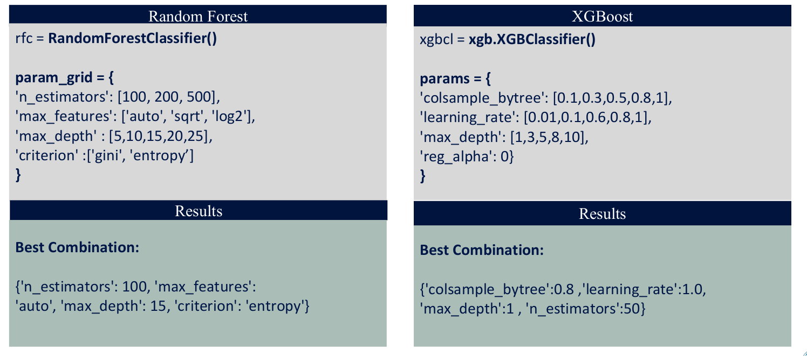

# Random-forest-and-XGBoost-model-for-Binary-Black-Holes

## DEPARTMENT OF PHYSICS AND ASTRONOMY "GALILEO GALILEI" ##

!Please do not copy this original work.

The purpose of this study is to investigate if it is possible to anticipate the key outcomes of a BPS simulation given a set of initial variables using machine learning techniques.

It is possible for a big binary star to evolve into a binary compact object. A tight massive binary star goes through a number of intricate physical processes over its lifetime. For example, the two stars can exchange mass either by steady mass transfer or through a shared envelope. The final masses and orbital characteristics of the two compact objects are significantly affected by this.
The study of the evolution of massive binaries and their effects on the demography of compact object binaries requires the use of binary population-synthesis codes (BPS). While binary processes are simulated using analytic and semi-analytic prescriptions, BPS implements single stellar evolution (SSE) using functional forms tuned on evolutionary tracks or the on-the-fly interpolation of evolutionary tracks.

In order to determine the initial circumstances that will lead to a binary black hole merger within an Hubble time, classification algorithms are being trained.The population synthesis code SEVN is used to produce the training set.

# Binary Black Holes

Two black holes in close orbit around one another make up a binary black hole (BBH). Similar to black holes, binary black holes are frequently split into stellar binary black holes, which are thought to be the outcome of galactic mergers, stellar binary supermassive black holes, and binary black holes of intermediate mass.

Due to the characteristics of black holes and the limited methods of detection, it was challenging to prove the existence of binary black holes for a long time. However, if two black holes merge, a tremendous quantity of energy should be released as gravitational waves, with recognizable waveforms that can be predicted using general relativity.

# Dataset Description

1) Mass_0/1: total mass of a star in Msun

2) Radius_0/1: radius of a star in Rsun

3) Luminosity_0/1: luminosity of a star in Lsun

4) Temperature_0/1: effective temperature of a star in Kelvin (temperature of a black body that would emit the same
total amount of electromagnetic radiation)

5) Phase_0/1: SEVN simulation stellar phase (it goes from 1 to 7)

6) RemnantType_0/1: type of the final product of the stellar life (black hole/neutron star/white dwarf)

7) Semimajor: orbital semimajor axis of the binary in Rsun

8) Eccentricity: orbital eccentricity of the binary

9) GWtime: time value in Myr obtained with a general relativity approximation

10) BWolrdtime: time elapsed in the simulations in Myr (starting always from 0)

# Methods and Models

The same dataset has been used to train both Random Forets and XGBoost Classifiers for performance comparison.

# Training & GridSearchCV

# Feature Importance

# Confusion Matrix

